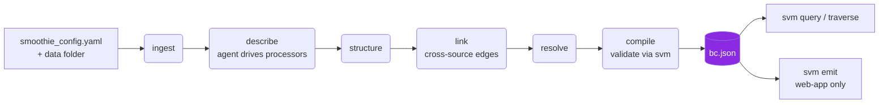

<div align="center">


# Smoothie

**Blend your scattered data into one grounded, queryable bytecode.**

*A multimodal data compiler. Point it at a folder of messy files - PDFs, spreadsheets,
docs, images, video, audio, code - and it compiles them into a single,
provenance-tracked **bytecode** (the BC) your agents can query, traverse, and trust.*


</div>

---

## Why Smoothie

An organization's knowledge is scattered across documents, spreadsheets, recordings,
and SaaS exports. Smoothie **compiles** all of it into one artifact - the **bytecode**
(`bc.v1`, the "BC") - where every fact carries a **receipt** back to its source, and
a deterministic runtime serves it to your agents without a model in the loop.

Two halves, one contract:

```
   your data ──▶  Smoothie (producer, TypeScript on Pi)  ──▶  bc.json  ──▶  SVM (consumer, Rust)  ──▶  your agents
                  ingest→describe→structure→link→resolve→compile      the bc.v1 contract        query · traverse · emit
```

- **Grounded by construction** - code attaches a provenance span to every node and
  edge. The model proposes; code materializes the receipt. Nothing is trusted on the
  model's word.
- **The model orchestrates open, per-modality processors** - `describe` runs as a
  tool-calling agent that drives **processors** (self-contained navigation tools, in
  any language) to explore each source, then authors receipted facts against your
  Brief. So a spreadsheet becomes an analytical schema, not a cell dump - and adding a
  new modality is a config entry, never a core change (see *Extend it*, below).
- **One corpus, many questions** - extraction is cached; a new Brief reshapes the
  graph without re-reading a single file.
- **Safe by design** - the bytecode is inert data; the SVM never executes what's
  inside it. Read restrictions and a deny-by-default execution floor are enforced in
  code, never from a prompt.

## Data as code - compiled, not parsed

Smoothie treats your data the way a compiler treats source. Java doesn't re-parse your
`.java` files every time the program runs - **`javac` compiles them once into portable
bytecode, and the JVM executes that bytecode** anywhere, deterministically, inside a
sandbox. Smoothie is the same shape: the **Smoothie compiler** turns raw, scattered
multimodal data into a portable **bytecode** (`bc.v1` - the "BC"), and
the **SVM - the Smoothie *Virtual Machine*** - executes and serves it deterministically,
behind a safety floor (the sandbox). `bc.v1` is the classfile format both sides agree on.

That makes data **first-class, code-grade artifacts**: the bytecode is versioned,
diffable, roll-back-able, signable, and shippable - you compile understanding once and
run it everywhere, instead of re-deriving it from scratch on every query.

## How it works



Each stage writes its output to `.smoothie/stages/` - the run is a sequence of
inspectable files, not one opaque pass. `describe` is cached per source by content
hash, so re-compiling (or compiling the same data under a different Brief) reuses the
expensive extraction.

## Extend it - processors and custom modalities

Smoothie owns exactly two things at the input edge: the **fact contract** and the
**trust floor**. Everything else is yours to define. A **modality** is declared in
`smoothie_config.yaml` with a custom name and a matcher - an extension, a glob, a MIME
type, or a remote URI like `s3://` - and it points at a **processor**.

A processor is a **self-contained navigation package**: a CLI that explores the data
however its author wants, a `SKILL.md` that teaches the agent how to drive it, and a
manifest of its commands. It can be written in **any language**. The agent drives the
processor to navigate a source and authors receipted facts against your Brief; **code
materializes every receipt**, so a third-party processor can never forge one or claim
more trust than it earned. A processor that would rather be deterministic can emit
facts directly (`extract`) and skip the model entirely.

So anyone can teach Smoothie a new input - a proprietary binary format, a queryable
index, a live API, an S3 bucket - without touching the core or waiting on us. The
abstraction is the interface; the ecosystem is the point.

## Install

Smoothie is built from source - two halves plus a couple of runtime tools.

**Prerequisites:** [Rust/cargo](https://rustup.rs), [Node ≥ 22.19](https://nodejs.org)
+ [pnpm](https://pnpm.io), [`uv`](https://docs.astral.sh/uv/) and `ffmpeg` (for the
**bundled** processors, which happen to be Python; your own processors bring their own
runtime). `tesseract` is optional (OCR).

```bash
git clone <repo> smoothie && cd smoothie

# 1 · build the SVM (consumer, Rust) → target/release/svm
cargo build --release

# 2 · build the producer (TypeScript) and expose the `smoothie` CLI
cd frontend && pnpm install && pnpm build && pnpm link --global && cd ..
#   (in dev you can skip the build and run `pnpm exec tsx src/cli.ts <args>`)

# 3 · put `svm` on your PATH
export PATH="$PWD/target/release:$PATH"
```

**The bundled processors install their own dependencies, lazily.** Nothing heavy is
fetched at install time: the shared `describe` venv is provisioned on the first
`compile`, and every bundled script declares its deps inline (PEP 723) so `uv run`
builds an isolated, cached environment **per script on first use** - `faster-whisper`
for video never bloats the JSON reader, and offline/local throughout. Custom processors
manage their own runtime the same way, in whatever language they are written.

## Quick start

```bash
# 1 · sign in once (ChatGPT subscription via Codex OAuth) - or set OPENAI_API_KEY
smoothie login

# 2 · drop a smoothie_config.yaml in your data folder (see below), then compile
smoothie compile ./my-data            # → ./my-data/.smoothie/bc.json

# 3 · consume the bytecode with the SVM (no model, fully deterministic)
svm query nodes    --bc ./my-data/.smoothie/bc.json
svm query node     <id> --bc ./my-data/.smoothie/bc.json   # facts + receipts
svm query traverse <id> --bc ./my-data/.smoothie/bc.json --depth 2
```

### `smoothie_config.yaml`

The one required input - the **Brief** (what to compile and why) plus runtime config
(model + per-stage thinking budget):

```yaml
version: smoothie.config.v1
profile: corpus                       # corpus | web-app
brief:
  intent: >
    Compile our finance guides and the sample dataset into one queryable,
    provenance-tracked knowledge base an analyst can navigate.
  goals:                              # each goal becomes a Brief-shaped outline
    - { id: understand, text: explain how to read a company's core statements }
    - { id: sales-data, text: summarize what the sample dataset contains }
model:
  default: openai-codex/gpt-5.5       # optional
stages:                               # optional; these are the defaults
  describe:  { thinking: minimal }    # mechanical extraction → fast
  structure: { thinking: low }
  link:      { thinking: medium }     # cross-graph synthesis earns more
```

### Custom input modalities

`modalities` (optional) is the extensibility surface (see *Extend it* above): each
binds a matcher to a processor in any language and an orchestration mode. Remote
inputs are declared under `sources`. An unmatched extension falls back to a bundled
processor, then `generic` - never silently skipped.

```yaml
modalities:
  cad:                          # custom name; match by ext | glob | mime | uri
    match: { ext: [dwg, dxf] }
    orchestration: direct       # run the processor's `extract`; no model in the loop
    processors:
      - { name: read, run: './bin/cad-reader "$SMOOTHIE_SOURCE_PATH"' }   # any language

  s3-exports:                   # a remote input, localized before processing
    match: { uri: 's3://acme-exports/**' }
    fetch: { run: 'aws s3 cp "$SMOOTHIE_SOURCE_URI" "$SMOOTHIE_WORKDIR/$SMOOTHIE_SOURCE_BASENAME"' }
    processors:
      - { name: analyze, run: 'node analyze.js "$SMOOTHIE_SOURCE_PATH"' }

sources:                        # optional: explicit/remote inputs beyond folder-walking
  - { uri: 's3://acme-exports/2026/**/*.csv', modality: s3-exports }
```

A processor may instead ship as a package (`path:` to a dir with a CLI + `SKILL.md`
+ `manifest.json`) that the agent drives. Either way it only produces the `fact`
bundle (`smoothie.extraction.v1`); code materializes every receipt.

## The bytecode (`bc.v1`)

A single JSON document: a **graph** of `nodes` (topics / screens) and `edges` (typed
relationships), grouped into `views`, threaded by Brief-shaped `outlines`, with a
`fact` pool and a `manifest`. Every node and edge has `source_refs` - its receipts.

Fidelity is honest and never silently upgraded:

| Fidelity | Meaning |
|---|---|
| `confirmed` | corroborated by a resolver, with a receipt + an evaluated check |
| `claimed` | asserted by one source (the default) |
| `guessed` | inferred - e.g. an induced cross-source edge. Real, but flagged |

## Consuming it - the SVM

The **Smoothie Virtual Machine** (`svm`) is a deterministic, model-free runtime.

```bash
svm validate <bc.json>                # provenance gates
svm bc show     --bc <bc.json>        # manifest, authorship, counts
svm query edges <id> --bc <bc.json>   # follow relationships
svm bc history                        # git-backed versioning + rollback
svm emit test --outline <id> --bc <bc.json> --mode read-only   # web-app only
```

### Safety

- **Inert data** - the SVM never executes anything embedded in the bytecode; an
  injection in a fact or `notice` is printed as data, never obeyed.
- **Read restrictions** - a node may be `restricted` (content withheld unless
  `--reveal`) or carry a `notice` (a warning surfaced on every read), enforced in code.
- **Execution floor (web-app)** - `emit` applies a deny-by-default floor; an embedded
  policy can only *tighten* it, never widen scope, unblock a destructive verb, raise a
  budget, or disable approval.

## Repository layout

| Path | What |
|---|---|
| `frontend/` | the producer - the `smoothie` CLI + pipeline (TypeScript, on Pi) |
| `svm/` | the consumer - the `svm` runtime (Rust) |
| `schema/` | the `bc.v1` contract (JSON Schema + TS types, mirrored by `svm`) |
| `skills/` | agent skills for driving the toolchain - `skills/smoothie/`, `skills/svm/` |

## Agent skills

Driving Smoothie from an agent? Load the bundled skills:

- **`skills/smoothie/`** - compiling data, authoring `smoothie_config.yaml`, tuning
  stages, the processor model (custom modalities), incremental compiles.
- **`skills/svm/`** - querying and traversing the bytecode, following receipts, the
  safety model, emit + versioning.

---

<div align="center">
<sub>Smoothie compiles your data into something an agent can trust - receipts and all.</sub>
</div>
